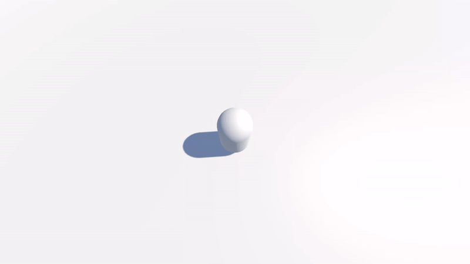

# Dev Log

## June 10, 2025
got the repo set up and did a tiny bit of brainstorming for the project - i settled on a survival horror. think resident evil, silent hill and other ps2 games like haunting ground. :satisfied:

also decided to start with camera and player movement... because there is no game without that part... following this [tutorial](https://www.youtube.com/watch?v=UCwwn2q4Vys), but i'm ngl my project was not doing as i commanded; camera movement was fine (needs tweaking) but the player is not doing as i say so i'll have to look into that.

i also need (and want) to study up on some survival horror games, so i'll have to play some in my free time and figure out what makes them so good... lowkey they scare me so i'll have to prepare myself. :cold_sweat:

## June 12, 2025
ok so it turns out, my player was working fine i just couldn't tell because i don't have a character model yet and it's just a white blob... on top of a temporary white ground LOL...

added a script for player movement... problem is there's like something going on with the drag (physics term), and i now realize i need to study up on physics maybe. :neutral_face:

thanks to this [tutorial](https://www.youtube.com/watch?v=f473C43s8nE). i will have to continue this and fix this whole drag situation... view the gif so you see what problem i'm talking about.

